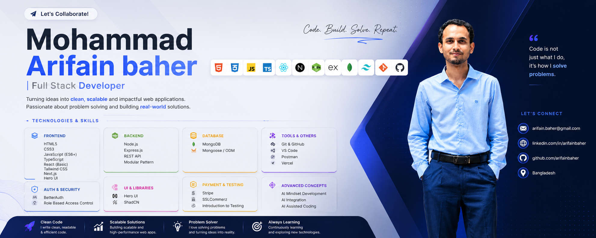

  

<h1 align="center">Hi 👋, I'm Mohammad Arifain Baher</h1>

<h3 align="center">
  Full-Stack Web Developer • Next.js • TypeScript • Node.js
</h3>

  Building modern, responsive, secure and real-world web applications 🚀

  

---

## 👨‍💻 About Me

- 🌱 Learning **AI-Driven Full-Stack Web Engineering**
- 💻 Working with **React, Next.js, TypeScript, Node.js & MongoDB**
- 🤖 Exploring **AI-Assisted Development & AI Integration**
- 🎯 Interested in building **scalable, secure and user-friendly applications**
- 📫 **mohammadarifinbaher530@gmail.com**

---

## 🌐 Connect with Me

  
  
  

---

## 💻 Tech Stack

  

  

  
  &nbsp;
  
  &nbsp;
  

 

  
  
  
  
  

  
  
  
  
  

  
  
  
  
  

  
  
  
  

---

## 🤖 AI-Assisted Development

  
  
  
  
  

  
  
  
  

  
  
  

---

## ⚡ Core Skills

  
  
  
  
  
  
  
  

---

## 📊 GitHub Stats

  &nbsp;
  

  

---

  <b>💻 Code &nbsp; • &nbsp; 🚀 Build &nbsp; • &nbsp; 🤖 Innovate</b>

  ⭐ Thanks for visiting my profile!

